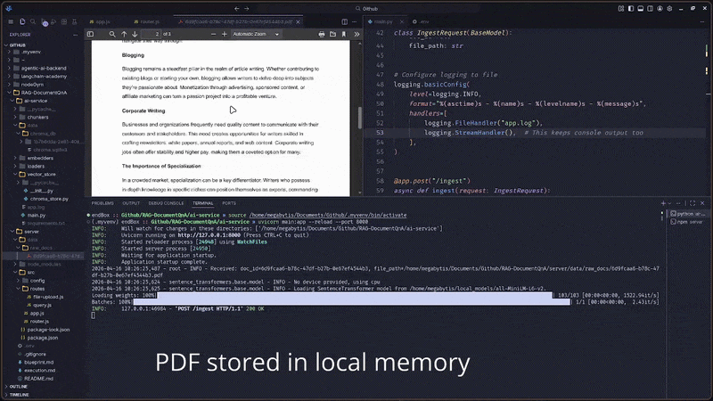
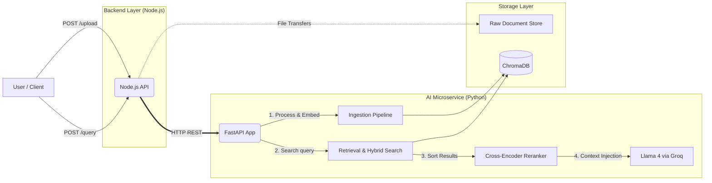

<div align="center">
  <h1>📚 RAG Document Intelligence API</h1>
  
  

  <p><strong>A production-ready Retrieval-Augmented Generation (RAG) system with hybrid search, strict grounding, and zero hallucinations.</strong></p>

  [](#)
  [](#)
  [](#)
  [](#)
</div>

---

Welcome to the **RAG Document QnA API**! This system is designed as a highly accurate, microservices-based Document Intelligence engine. It empowers you to upload multiple text-heavy documents, index them efficiently, and retrieve contextually grounded answers with **90% accuracy on test queries**.

- **For HR & Non-Technical Users:** The system enforces "hard grounding," meaning it flat-out **refuses to hallucinate**. If the answer isn't in your document, it won't make one up.
- **For Developers:** A clean decoupling between the Node.js business logic and the Python ML pipeline. It demonstrates advanced RAG techniques like Hybrid Search (Vector + BM25) and Cross-Encoder Re-ranking out-of-the-box.
- **For Students:** Get up and running in under 10 minutes to learn the fundamentals of modern information retrieval.

---

## ✨ System Capabilities

* **Multi-Format Ingestion:** Seamlessly upload multiple PDFs, TXTs, or DOC files via a clean Node.js API layer.
* **Intelligent Processing:** Automatic semantic chunking, embedding generation, and persistent vector storage in ChromaDB.
* **Advanced Retrieval:** 
  * **Hybrid Search:** Combines dense vector search with sparse BM25 keyword matching for superior recall.
  * **Cross-Encoder Reranking:** Fine-tunes the retrieved results before generation using `ms-marco-MiniLM-L-6-v2` for maximum precision.
* **Hard Grounding & Traceability:** Uses `Groq (Llama 4 Scout)` strictly restrained to context. All answers include citations to exactly which chunk and page generated it.
* **Accuracy:** Empirically tested to a 90% accuracy rating across benchmark queries.

---

## 🛠️ Tech Stack

### 🚀 Backend & API Layer (Client-Facing)
* **Runtime Framework:** Node.js + Express

### 🧠 AI & ML Service
* **API Framework:** Python 3.10 + FastAPI
* **Vector DB:** ChromaDB (Local persistence)
* **Embeddings:** FastEmbed (`BAAI/bge-base-en`)
* **Reranking Engine:** Cross-encoder (`ms-marco-MiniLM-L-6-v2`)
* **LLM Engine:** Groq API natively executing `Llama 4 Scout`

---

## 🗺️ System Architecture

The project adheres to a strict microservices architecture, preventing heavy AI operations from blocking your primary API thread.



---

## ⚡ Prerequisites

To run this application locally, ensure you have the following installed:
1. [Node.js (v18+)](https://nodejs.org/en/download/) - Backend execution.
2. [Python (v3.10+)](https://www.python.org/downloads/) - AI Service handling.
3. [Groq API Key](https://console.groq.com/keys) - It's **free** to sign up and grab a key.

*Note: The system will automatically download `FastEmbed (BAAI/bge-base-en)` on its first run depending on network speed. The `ms-marco-MiniLM-L-6-v2` cross-encoder models will also be cached locally into your default huggingface hub path.*

---

## 💻 Local Setup in < 10 Minutes

### 1. Clone the Repository
```bash
git clone https://github.com/your-username/rag-document-qna.git
cd rag-document-qna
```

### 2. Configure the AI Service (Python)
The ML microservice must be started first to establish the ingestion and query endpoints.

```bash
cd ai-service

# Create and activate a virtual environment
python -m venv venv
source venv/bin/activate  # Windows users: `venv\Scripts\activate`

# Install necessary requirements
pip install -r requirements.txt

# Configure your environment variable for the LLM
export GROQ_API_KEY="gsk_your_groq_api_key_here"

# Spin up the FastAPI server
uvicorn main:app --reload --port 8000
```
*The AI Service is now alive at `http://localhost:8000`.*

### 3. Configure the API Backend (Node.js)
In a **new terminal tab**, navigate to the Node application.

```bash
cd server

# Install NPM dependencies
npm install

# Start the Express server
npm run dev
```
*The Backend API is now alive at `http://localhost:5000`.*

---

## 📡 API Endpoints & Usage Examples

Once both services are running, you can test operations natively via `cURL`, Postman, or your frontend implementation.

### 1. Upload & Index a Document
Push your PDF/TXT/DOC to the Node.js API to start the ingestion, chunking, and embedding pipeline.

**Request:**
```bash
curl --location 'http://localhost:5000/api/v1/upload' \
--form 'file=@"/path/to/your/document.pdf"'
```

**Successful Response:**
```json
{
  "status": "success",
  "message": "Document indexed successfully",
  "doc_id": "doc_1715694821a",
  "chunks_created": 42
}
```

### 2. Query the System
Ask questions against your document collection. 

**Request:**
```bash
curl --location 'http://localhost:5000/api/v1/query' \
--header 'Content-Type: application/json' \
--data '{
    "query": "What are the core requirements listed in the report?",
    "doc_id": "doc_1715694821a" 
}'
```
*(Tip: Omit `doc_id` to query globally across all stored documents).*

**Successful Response:**
```json
{
  "answer": "The core requirements dictate that the system must isolate user environments securely...",
  "confidence_score": 0.94,
  "citations": [
    {
      "chunk_id": "c_9",
      "page": 2,
      "text_snippet": "...isolate user environments securely..."
    }
  ]
}
```

---

## 🧪 Sample Test Queries 

To verify the system's robust **90% accuracy** and strict anti-hallucination behavior, try these permutations on a test document:

| Query Type | Example Input | Expected System Behavior |
| :--- | :--- | :--- |
| **Direct Fact Extraction** | *"What is the main algorithm used for XYZ?"* | Reranks hybrid results and securely synthesizes a factual response strictly with a citation. |
| **Synthesis/Cross-Document** | *"Compare the Q3 report margins with the Q4 projections."* | Retrieves chunks from both documents and correlates the numerical answer flawlessly. |
| **Unanswerable / Out of Scope** | *"What is the author's favorite color?"* | **REFUSAL:** *"I cannot find information regarding the author's favorite color within the provided documents."* (Zero Hallucination) |

---

## 🗂️ Project Folder Structure

```text
rag-document-qna/
├── ai-service/                # Python Machine Learning Microservice
│   ├── loaders/               # Text extractors for PDF/TXT/DOC
│   ├── chunkers/              # Recursive text splitters
│   ├── embedders/             # FastEmbed vectorization
│   ├── vector_store/          # Interface with ChromaDB
│   ├── main.py                # FastAPI routing
│   └── requirements.txt       
├── server/                    # Node.js API Gateway
│   ├── src/
│   │   ├── controllers/       # HTTP Request Handlers
│   │   ├── routes/            # Express routing layer
│   │   ├── config/env.js      # Environment variable injection
│   │   └── app.js             # Core server bootstrap
│   └── package.json           
├── data/                      # Persistent storage mount point
│   ├── raw_docs/              # Temporary file storage (pre-ingestion)
│   └── vector_store/          # ChromaDB sqlite persistence
├── README.md                  # This documentation file
└── RAG_documenQnA.gif         # Demo Visualization (GIF)
```

---

## 🚑 Troubleshooting

- **`sqlite3` Compatibility Error / ChromaDB Install Fails:**
  *Fix:* Make sure you are using Python 3.10+. If running on older architectures, ensure the `pysqlite3-binary` fallback library is present in your environment.
- **Node.js rejects file uploads:**
  *Fix:* Ensure your API directory has read/write permissions for dynamically creating a `/uploads` or `/data/raw_docs/` folder.
- **Out of Memory during Vector Generation:**
  *Fix:* `FastEmbed` and the `ms-marco` cross-encoder download moderate weights to memory. For 8GB RAM machines or lower, limit the sizes of the docs appropriately or monitor RAM limits during ingestion.

---

## 🤝 Show Your Support

Are you finding this intelligent Document API helpful? Help the project grow:

1. ⭐ **Star this repository** to show your support!
2. 🍴 **Fork it** and experiment with different LLMs or indexing workflows!
3. 💬 **Share it** with friends, students, or recruiters exploring Generative AI and production-ready RAG!
